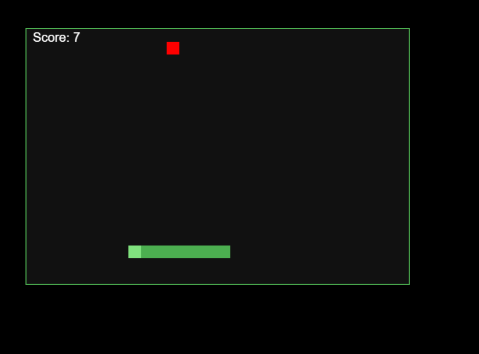
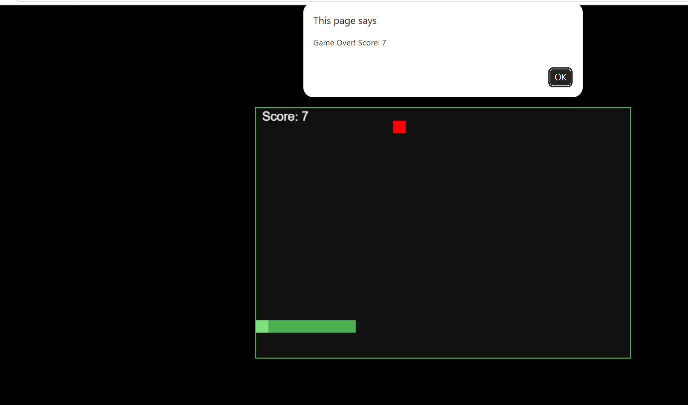

# Snake Game — Speed Increases

A polished browser-based Snake game built with HTML, CSS, and JavaScript.

## Overview

This project demonstrates a responsive Snake game experience with intuitive controls, score tracking, and progressively increasing speed. It is implemented as a single HTML file and runs in any modern web browser without dependencies.

## Highlights

- Classic Snake gameplay with a clean visual style
- Automatically grows the snake when food is eaten
- Score display updates in real time
- Game speed increases each time the snake eats food
- Collision detection for walls and the snake itself
- Automatic restart after game over

## Files

- `velo.html` — main game file containing the full HTML, CSS, and JavaScript implementation
- `output/` — directory containing demo screenshots for the game

## Demo

Open the demo directly in your browser:

- [Open demo in browser](https://vedashivayogi.github.io/VeloSnake-/velo.html)

You can also view the demo screenshots:

- `output/starting.png`
- `output/ending.png`

## How to Run

1. Open `velo.html` in a browser such as Chrome, Edge, or Firefox.
2. Use the arrow keys to guide the snake.
3. Consume the red food blocks to increase your score and speed.

## Controls

- `ArrowUp` — move up
- `ArrowDown` — move down
- `ArrowLeft` — move left
- `ArrowRight` — move right

## Notes

- Speed increases gradually as the score rises, increasing the challenge.
- The game resets automatically after a collision.

## License

This project is provided for learning, demonstration, and customization.
