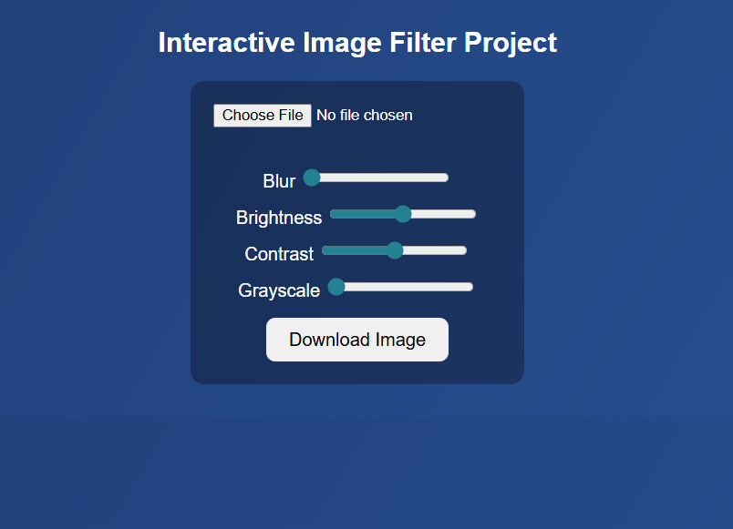
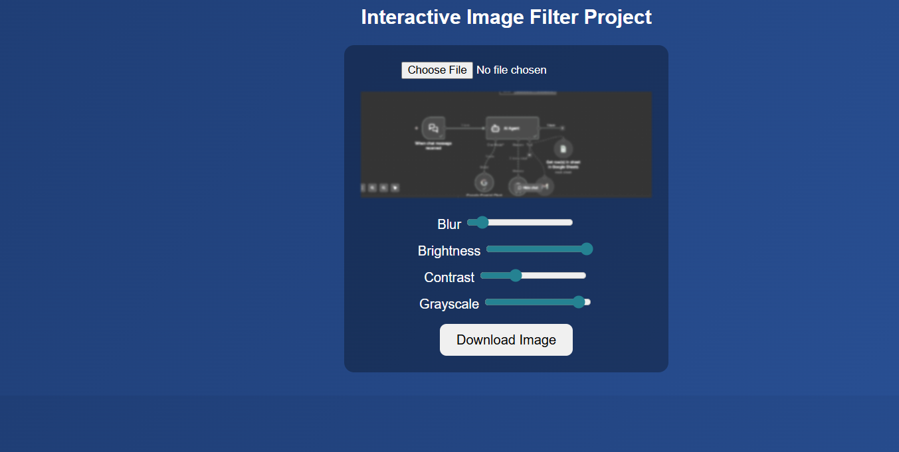

# Interactive Image Filter

A professional web-based image editing tool that allows users to apply real-time filters to images using HTML5 Canvas and CSS filters.

## Features

- **Upload Images**: Support for various image formats
- **Real-time Filters**: Apply multiple filters simultaneously
- **Filter Controls**:
  - Blur (0-10px)
  - Brightness (50-150%)
  - Contrast (50-150%)
  - Grayscale (0-100%)
- **Download Edited Images**: Save your filtered images as PNG files
- **Responsive Design**: Clean, modern UI with hover effects

## Demo

[View Live Demo](https://your-demo-link-here.com) _(Replace with actual demo URL)_

## Screenshots

### Original Image

### Filtered Image

## How to Use

1. Open `filter_img.html` in your web browser
2. Click "Choose File" to upload an image
3. Adjust the filter sliders to apply effects:
   - **Blur**: Adds blur effect
   - **Brightness**: Controls image brightness
   - **Contrast**: Adjusts image contrast
   - **Grayscale**: Converts to black and white
4. Click "Download Image" to save your edited image

## Technologies Used

- HTML5
- CSS3
- JavaScript (ES6+)
- HTML5 Canvas API

## Browser Support

- Chrome 60+
- Firefox 55+
- Safari 12+
- Edge 79+

## Installation

No installation required. Simply open the `filter_img.html` file in any modern web browser.

## Contributing

1. Fork the repository
2. Create a feature branch
3. Make your changes
4. Test thoroughly
5. Submit a pull request

## License

This project is licensed under the MIT License - see the LICENSE file for details.

## Author

[Veda] - [vedaram2002@example.com]

---

_Built with passion for web development and image processing._
